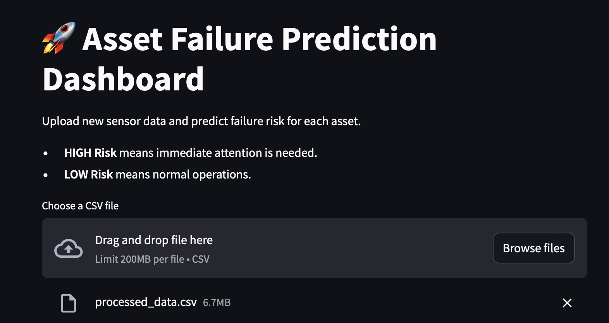
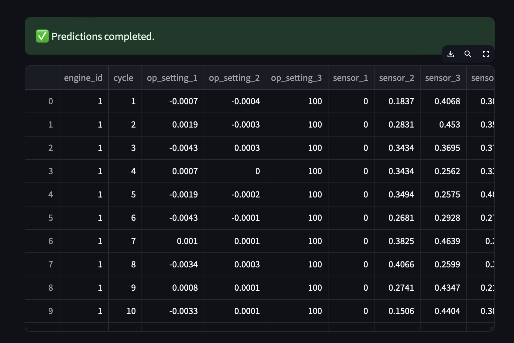
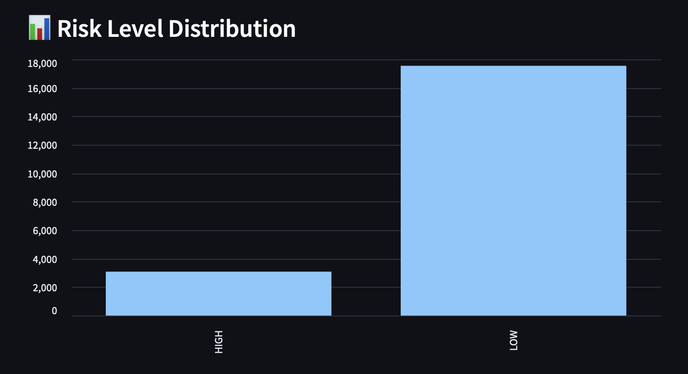
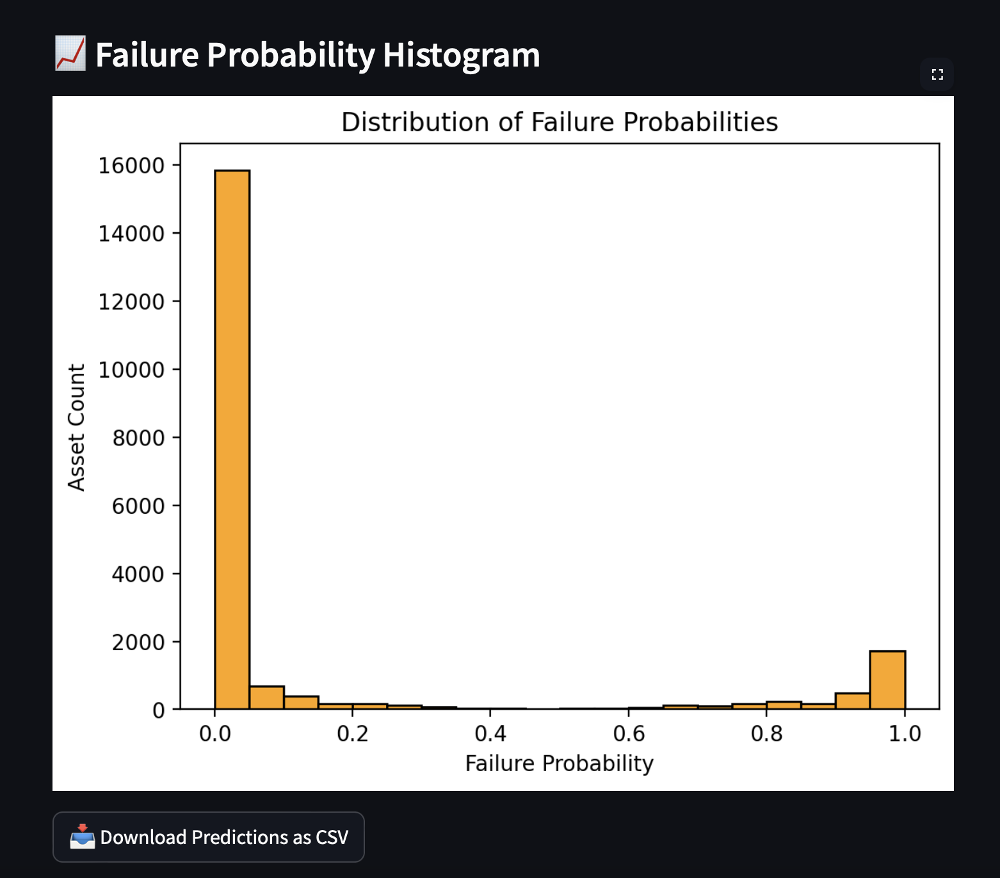

# Asset Failure Prediction System

A predictive maintenance dashboard that analyzes sensor data to detect potential failures in industrial assets. The system uses machine learning (Random Forest) to classify whether an asset is at HIGH or LOW risk of failure, helping organizations take proactive action and minimize downtime.

---

## Features

- ✅ Preprocess NASA C-MAPSS sensor data
- ✅ Compute Remaining Useful Life (RUL) and failure labels
- ✅ Train a Random Forest model using Scikit-learn
- ✅ Predict failure probability on new sensor inputs
- ✅ Streamlit dashboard for CSV upload, risk analysis, and visualization
- ✅ Download predictions directly from the app

---

## Project Structure
```
transit-safety-analytics/
│── data                            
│   ├── ..data                      #  Raw NASA C-MAPSS training data
│   │── processed_data.csv          # Cleaned and labeled dataset 
│── streamlit_app.py                # Streamlit App Dashboard for live use
│── data_preprocessing.py           # Script to preprocess and label data 
│── predict_failure.py              # Predictions on new inputs
│── train_model.py                  # Train Random Forest model
│── requirements.txt                # Python dependencies
│── README.md                       # Project documentation
```

## Installation

1. Clone the repository:
   ```bash
   gh repo clone Sarthak2403/Transit_Infrastructure_Safety_Event_Tracker
   cd Transit_Infrastructure_Safety_Event_Tracker

2. Create a virtual environment:
   ```bash
   python -m venv venv
   source venv/bin/activate  # On Windows use `venv\Scripts\activate`
   ```
3. Install dependencies:
   ```bash
   pip install -r requirements.txt
   ```

4. Download the data from:
```
https://catalog.data.gov/dataset/cmapss-jet-engine-simulated-data
```

## Usage
1. Preprocess sensor data:
```
python data_preprocessing.py
```

2. Train the model:
```
python train_model.py
```

3. Run inference on a sample:
```
python predict_failure.py
```

4. Launch the dashboard
To launch the dashboard, run:
```bash
streamlit run streamlit_app.py
```

5. Access the dashboard in your browser at http://localhost:8051

## Outputs

- Train Model :-

```
📊 Evaluation Metrics:
Accuracy: 0.9653501332687182
ROC AUC: 0.990140916324034
```

- Classification Report:

```

               precision    recall  f1-score   support

           0       0.98      0.98      0.98      3507
           1       0.89      0.87      0.88       620

    accuracy                           0.97      4127
   macro avg       0.94      0.93      0.93      4127
weighted avg       0.97      0.97      0.97      4127

Confusion Matrix:
 [[3443   64]
 [  79  541]]
```

- Prediction:-

```
🔍 Predicted Failure Probability: 0.24
⚠️ Failure Risk: LOW
```
- Dashboard App:







